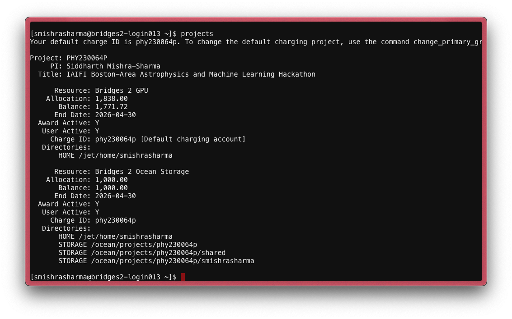
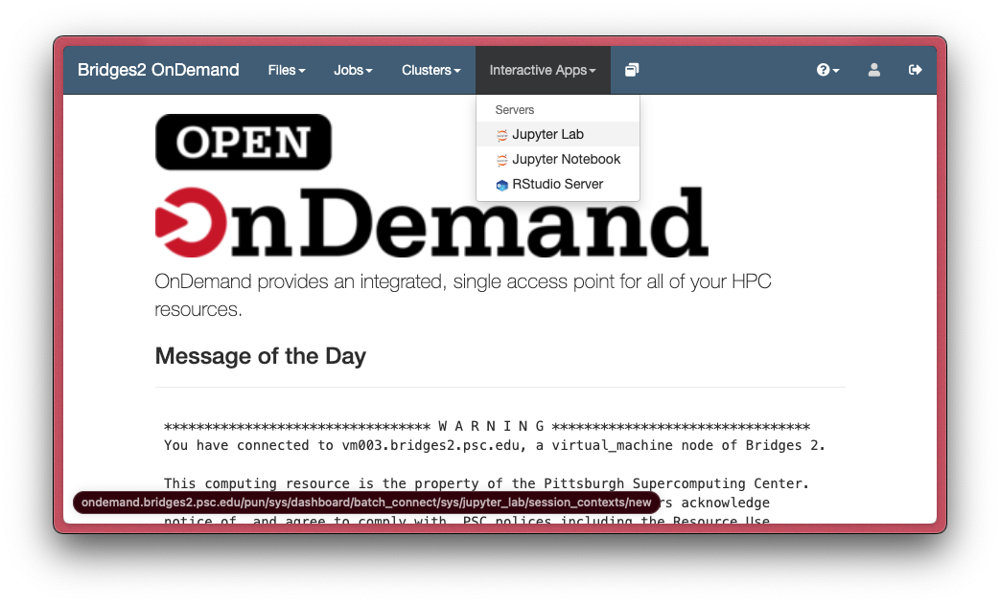
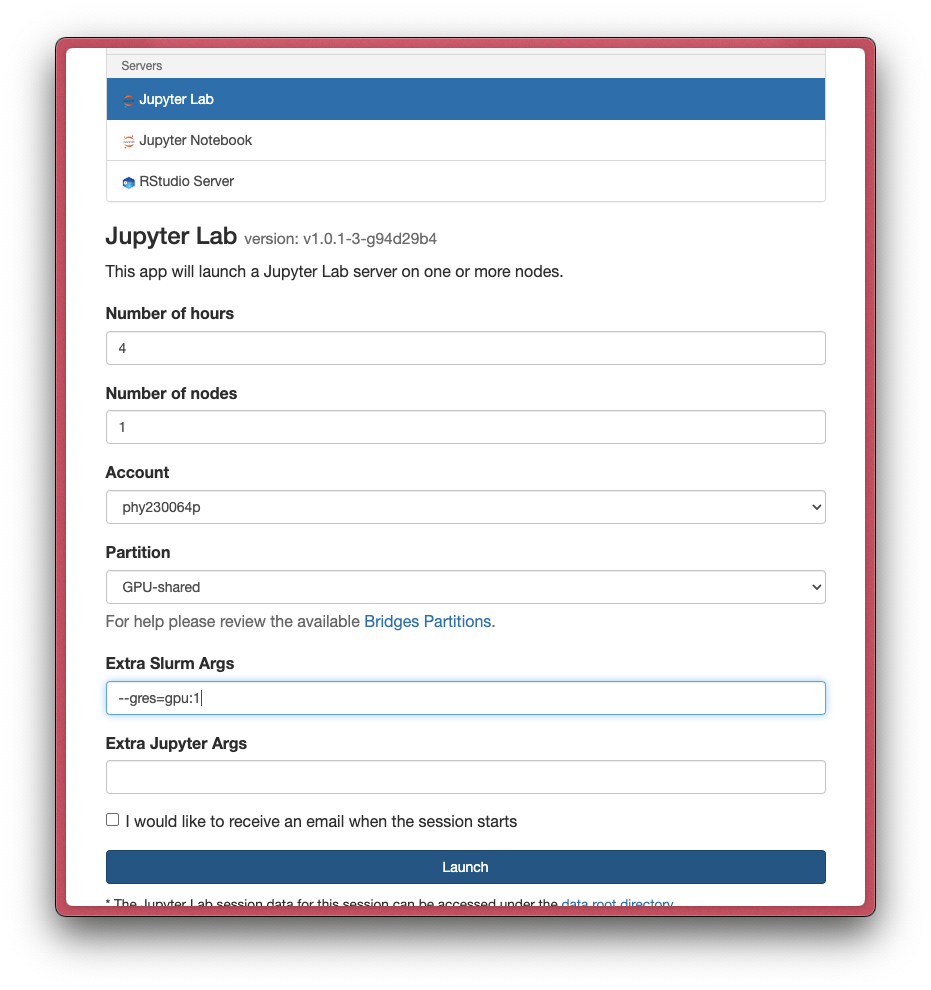

# HPC Guide for IAIFI Astro ML Hackathon 2024

## Resources overview

- We have an allocation of GPU resources on the Pittsburgh Supercomputing Center's Bridges-2 cluster for the hackathon.
- Additionally, we have reserved access to 48 Nvidia V100 GPUs just for participants during the course of the hackathon (Jan 22 - 24), which means no queues etc.

Basic workflows are described below. For more info, see this [presentation](https://deeplearning.cs.cmu.edu/F22/document/recitation/Recitation10/Introduction%20to%20PSC.pdf) [PDF] or the comprehensive Bridges-2 User Guide: https://www.psc.edu/resources/bridges-2/user-guide/.

## Getting started

- If you registered for an ACCESS account and entered your username in this [form](https://forms.gle/xnvayUbwC7ivAYRj9), we've added you to the allocation. After this, it can take a few days for an account to be created on the Bridges-2 cluster.
- You will first need to set up a password by following the instructions towards the top of https://www.psc.edu/resources/bridges-2/user-guide/. TLDR: if this is a new account, go to [apr.psc.edu](https://apr.psc.edu/) and create a password.

> [!NOTE]  
> The PSC username is different from the ACCESS username!

- You can then access the cluster through the terminal `ssh -Y [username]@bridges2.psc.edu`, which logs you to a login node.
- From the terminal, you can type `projects` to bring up info about quotas, storage directories etc.



- You can also easily login through your browser via OnDemand: https://ondemand.bridges2.psc.edu/.
	- Here, you can start e.g. a login terminal session (`Clusters > Bridge-2 Shell Access`) or launch a Jupyter Notebook/Lab job (`Interactive Apps > Jupyter...`)



> [!NOTE]  
> By default, OnDemand requests an entire GPU node (typically 8 GPUs). To request a single GPU (better use of resources), add `--gres=gpu:1` to the "Extra Slurm Args" field.



## Launching jobs and GPU python environment

- The easiest way to get started is probably to launch a Jupyter Notebook/Lab job using OnDemand (see above).
- You can launch an interactive job using the `interact` command, and specifically a GPU job via `interact -gpu -t 01:00:00` (this launches a 1h GPU job with some sensible default configurations).
- You can check that you have access to GPU(s) via the `nvidia-smi` terminal command.
- The easiest way to instantiate an AI-ready environment is to to load a predefined set of modules (see available ones via `module spider AI`).
	- E.g., `module load AI/pytorch_23.02-1.13.1-py3` will work for common use-cases.
	- You can install additional modules as needed via e.g. `pip install astropy`, which will install to local user directories. 

## Storage

Here are the relevant directories as they appear in the output of the `projects` command (with username replaced where necessary):
```
   Directories:
       HOME /jet/home/smishrasharma
       STORAGE /ocean/projects/phy230064p
       STORAGE /ocean/projects/phy230064p/shared
       STORAGE /ocean/projects/phy230064p/smishrasharma
```
In particular, shared datasets will be in `/ocean/projects/phy230064p/shared`.

## Launching batch jobs

Jobs can be submitted using the SLURM scheduler. Here is a minimal example script (`gpu_job.sh`) that requests 1 GPU and 8h of runtime for the program `gpu_program.py`. You can submit it via `sbatch gpu_job.sh`.

``` bash
#!/bin/bash

#SBATCH --job-name=train
#SBATCH --nodes=1
#SBATCH -p GPU
#SBATCH -t 8:00:00
#SBATCH --gpus=v100-32:1  # Request 1 GPU. --gres=gpu:1 is also fine.

set -x  # Echo commands to stdout

cd /ocean/projects/phy230064p/username

# Run code
python gpu_program.py
```

`squeue [-u username]` will show you the status of your jobs, and `scancel [jobid]` will cancel a job. For more options, see https://www.psc.edu/resources/bridges-2/user-guide/. 
